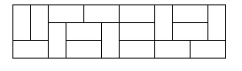

# BOJ 2133번: 타일 채우기

## 제한

- 시간 제한: 2 초
- 메모리 제한: 128 MB

## 문제

3×N 크기의 벽을 2×1, 1×2 크기의 타일로 채우는 경우의 수를 구해보자.

## 입력

첫째 줄에 N(1 ≤ N ≤ 30)이 주어진다.

## 출력

첫째 줄에 경우의 수를 출력한다.

## 예제 입력 1

```
2
```

##### 예제 출력 15

```
3
```

## 힌트

아래 그림은 3×12 벽을 타일로 채운 예시이다.


